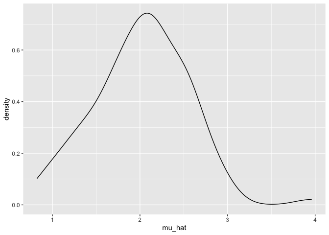
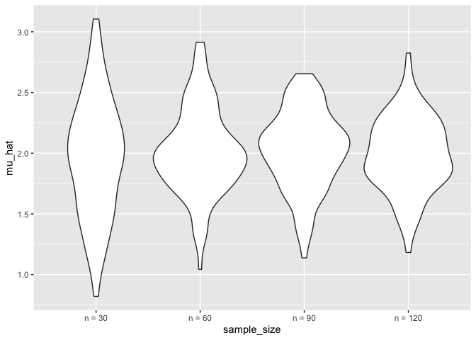
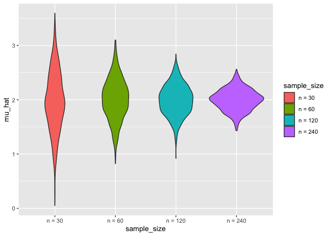
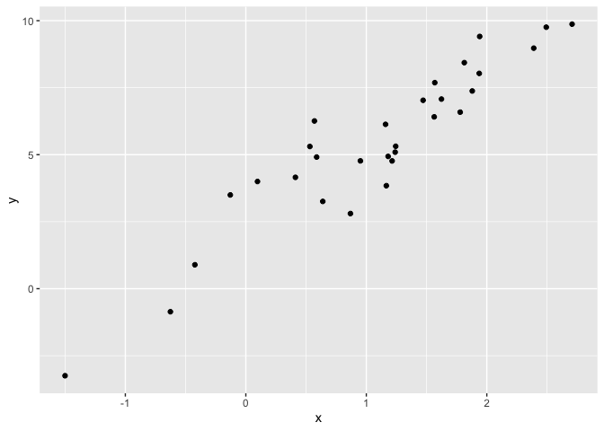
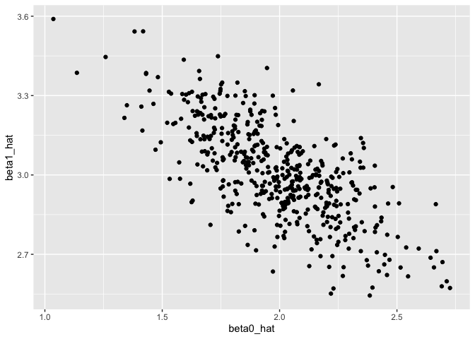
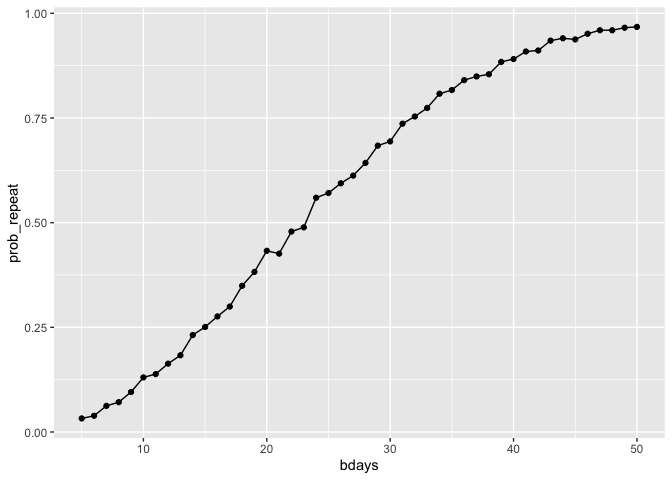
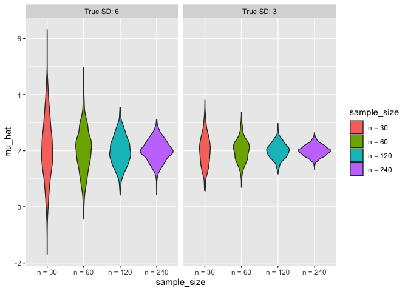

Simulation
================

Load key package and source necessary files.

``` r
library(tidyverse)
```

    ## ── Attaching core tidyverse packages ──────────────────────── tidyverse 2.0.0 ──
    ## ✔ dplyr     1.1.4     ✔ readr     2.1.5
    ## ✔ forcats   1.0.0     ✔ stringr   1.5.1
    ## ✔ ggplot2   3.5.2     ✔ tibble    3.3.0
    ## ✔ lubridate 1.9.4     ✔ tidyr     1.3.1
    ## ✔ purrr     1.1.0     
    ## ── Conflicts ────────────────────────────────────────── tidyverse_conflicts() ──
    ## ✖ dplyr::filter() masks stats::filter()
    ## ✖ dplyr::lag()    masks stats::lag()
    ## ℹ Use the conflicted package (<http://conflicted.r-lib.org/>) to force all conflicts to become errors

``` r
set.seed(1)

source("sim_mean_sd.R")
```

We can “simulate” by running our function.

``` r
sim_mean_sd(n_subj = 400)
```

    ## # A tibble: 1 × 2
    ##   mu_hat sigma_hat
    ##    <dbl>     <dbl>
    ## 1   2.11      2.91

## Simulation: Mean and SD for one N

``` r
sim_mean_sd = function(n_subj, mu = 2, sigma = 3) {
  
  sim_data = tibble(
    x = rnorm(n = n_subj, mean = mu, sd = sigma),
  )
  
  sim_data |> 
    summarize(
      mu_hat = mean(x),
      sigma_hat = sd(x)
    )
}
```

Can I verify the Central Limit Theorem?

First try with a ‘for’ loop

``` r
output = vector("list", 100)

for (i in 1:100) {
  output[[i]] = sim_mean_sd(30)
}

sim_results = bind_rows(output)
```

``` r
sim_results
```

    ## # A tibble: 100 × 2
    ##    mu_hat sigma_hat
    ##     <dbl>     <dbl>
    ##  1  2.03       3.06
    ##  2  0.824      3.40
    ##  3  2.58       3.40
    ##  4  1.76       3.73
    ##  5  2.11       2.66
    ##  6  1.78       3.06
    ##  7  2.23       3.06
    ##  8  1.70       3.24
    ##  9  1.02       3.54
    ## 10  1.14       3.00
    ## # ℹ 90 more rows

``` r
sim_results |> 
  ggplot(aes(x = mu_hat)) + 
  geom_density()
```

<!-- -->

Try to repeat with a ‘map’ statement.

``` r
sim_results_df = 
  tibble(iter = 1:100) |>
  mutate(results = map(iter, sim_mean_sd, n_subj = 30)) |>
  unnest(results)

sim_results_df
```

    ## # A tibble: 100 × 3
    ##     iter mu_hat sigma_hat
    ##    <int>  <dbl>     <dbl>
    ##  1     1   1.09      2.89
    ##  2     2   2.01      2.65
    ##  3     3   2.10      2.99
    ##  4     4   4.59      3.21
    ##  5     5   5.55      3.00
    ##  6     6   5.76      2.97
    ##  7     7   6.85      3.28
    ##  8     8   6.89      2.82
    ##  9     9   9.68      2.98
    ## 10    10   9.41      3.63
    ## # ℹ 90 more rows

## Data frame with multiple iterations for multiple sample sizes

``` r
sim_results_df = 
  expand_grid(
    sample_size = 30,
    iter = 1:100
  ) |> 
  mutate(
    estimate_df = map(sample_size, sim_mean_sd)
  ) |> 
  unnest(estimate_df)

sim_results_df
```

    ## # A tibble: 100 × 4
    ##    sample_size  iter mu_hat sigma_hat
    ##          <dbl> <int>  <dbl>     <dbl>
    ##  1          30     1   1.83      2.65
    ##  2          30     2   2.32      3.61
    ##  3          30     3   2.51      3.43
    ##  4          30     4   1.49      2.66
    ##  5          30     5   1.09      3.55
    ##  6          30     6   1.99      2.34
    ##  7          30     7   1.70      2.86
    ##  8          30     8   2.41      2.99
    ##  9          30     9   2.89      2.76
    ## 10          30    10   2.55      3.01
    ## # ℹ 90 more rows

``` r
sim_results_df = 
  expand_grid(
    sample_size = c(30,60,90,120),
    iter = 1:100
  ) |> 
  mutate(
    estimate_df = map(sample_size, sim_mean_sd)
  ) |> 
  unnest(estimate_df)

sim_results_df
```

    ## # A tibble: 400 × 4
    ##    sample_size  iter mu_hat sigma_hat
    ##          <dbl> <int>  <dbl>     <dbl>
    ##  1          30     1   2.32      3.11
    ##  2          30     2   2.09      3.52
    ##  3          30     3   2.42      3.15
    ##  4          30     4   2.11      2.98
    ##  5          30     5   1.55      3.68
    ##  6          30     6   2.33      2.46
    ##  7          30     7   2.22      2.40
    ##  8          30     8   1.64      3.02
    ##  9          30     9   2.31      3.43
    ## 10          30    10   1.95      3.24
    ## # ℹ 390 more rows

Let’s look at this:

``` r
sim_results_df |>
  mutate(
    sample_size = str_c("n = ", sample_size), 
    sample_size = fct_inorder(sample_size)
  ) |>
  ggplot(aes(x = sample_size, y = mu_hat)) +
  geom_violin()
```

<!-- -->

Let’s try to summarize

``` r
sim_results_df |> 
  pivot_longer(
    mu_hat:sigma_hat,
    names_to = "parameter", 
    values_to = "estimate") |> 
  group_by(sample_size) |> 
  summarize(
    emp_mean = mean(estimate),
    emp_sd = sd(estimate)) |> 
  knitr::kable(digits = 3)
```

| sample_size | emp_mean | emp_sd |
|------------:|---------:|-------:|
|          30 |    2.444 |  0.656 |
|          60 |    2.499 |  0.572 |
|          90 |    2.502 |  0.554 |
|         120 |    2.499 |  0.578 |

## Simulation: Mean for several 𝑛

``` r
sim_results_df = 
  expand_grid(
    sample_size = c(30, 60, 120, 240),
    iter = 1:1000
  ) |> 
  mutate(
    estimate_df = map(sample_size, sim_mean_sd)
  ) |> 
  unnest(estimate_df)
```

``` r
sim_results_df |> 
  mutate(
    sample_size = str_c("n = ", sample_size),
    sample_size = fct_inorder(sample_size)) |> 
  ggplot(aes(x = sample_size, y = mu_hat, fill = sample_size)) + 
  geom_violin()
```

<!-- -->

``` r
sim_results_df |> 
  pivot_longer(
    mu_hat:sigma_hat,
    names_to = "parameter", 
    values_to = "estimate") |> 
  group_by(parameter, sample_size) |> 
  summarize(
    emp_mean = mean(estimate),
    emp_var = var(estimate)) |> 
  knitr::kable(digits = 3)
```

    ## `summarise()` has grouped output by 'parameter'. You can override using the
    ## `.groups` argument.

| parameter | sample_size | emp_mean | emp_var |
|:----------|------------:|---------:|--------:|
| mu_hat    |          30 |    1.977 |   0.297 |
| mu_hat    |          60 |    2.014 |   0.144 |
| mu_hat    |         120 |    1.994 |   0.079 |
| mu_hat    |         240 |    1.999 |   0.038 |
| sigma_hat |          30 |    2.980 |   0.146 |
| sigma_hat |          60 |    2.996 |   0.079 |
| sigma_hat |         120 |    2.992 |   0.038 |
| sigma_hat |         240 |    2.994 |   0.020 |

## Simulation: Simple Linear Regression for one 𝑛

``` r
sim_df = 
  tibble(
    x = rnorm(30, mean = 1, sd = 1),
    y = 2 + 3 * x + rnorm(30, 0, 1)
  )

sim_df |> 
  ggplot(aes(x = x, y = y)) + 
  geom_point()
```

<!-- -->

``` r
slr_fit = lm(y ~ x, data = sim_df)

coef(slr_fit)
```

    ## (Intercept)           x 
    ##    2.254383    2.932010

turn this into a function

``` r
sim_regression = function(n_subj, beta_0 = 2, beta_1 = 3) {
  
  sim_df = 
    tibble(
      x = rnorm(n_subj, mean = 1, sd = 1),
      y = beta_0 + beta_1 * x + rnorm(n_subj, 0, 1)
    )

  slr_fit = lm(y ~ x, data = sim_df)

  tibble(
    beta0_hat = coef(slr_fit)[1],
    beta1_hat = coef(slr_fit)[2]
  )
}
```

``` r
sim_regression(n_subj = 30)
```

    ## # A tibble: 1 × 2
    ##   beta0_hat beta1_hat
    ##       <dbl>     <dbl>
    ## 1      1.95      2.76

``` r
output = vector("list", length = 500)

for (i in 1:500) {
  
  output[[i]] = sim_regression(n_subj = 30)
  
}

output |> 
  bind_rows()
```

    ## # A tibble: 500 × 2
    ##    beta0_hat beta1_hat
    ##        <dbl>     <dbl>
    ##  1      1.61      3.19
    ##  2      1.86      3.14
    ##  3      2.23      2.57
    ##  4      1.54      3.40
    ##  5      1.98      3.24
    ##  6      1.86      2.96
    ##  7      1.72      2.90
    ##  8      2.13      2.63
    ##  9      2.03      2.83
    ## 10      1.75      3.27
    ## # ℹ 490 more rows

``` r
slr_sim_results_df = 
  expand_grid(
    sample_size = 30, 
    iter = 1:500
  ) |> 
  mutate(
    results = map(sample_size, sim_regression)
  ) |> 
  unnest(results)

slr_sim_results_df |> 
  ggplot(aes(x = beta0_hat, y = beta1_hat)) + 
  geom_point()
```

<!-- -->

## One more example!

``` r
birthdays = sample(1:365, 5, replace = TRUE)

repeated_bday = length(unique(birthdays)) < 5

repeated_bday
```

    ## [1] FALSE

put this in a function

``` r
bday_sim = function(n_room) {
  
  birthdays = sample(1:365, n_room, replace = TRUE)

  repeated_bday = length(unique(birthdays)) < n_room

  repeated_bday
  
}

bday_sim(20)
```

    ## [1] TRUE

``` r
bday_sim_results = 
  expand_grid(
    bdays = 5:50, 
    iter = 1:2500
  ) |> 
  mutate(
    result = map_lgl(bdays, bday_sim)
  ) |> 
  group_by(
    bdays
  ) |> 
  summarize(
    prob_repeat = mean(result)
  )

bday_sim_results
```

    ## # A tibble: 46 × 2
    ##    bdays prob_repeat
    ##    <int>       <dbl>
    ##  1     5      0.0324
    ##  2     6      0.0388
    ##  3     7      0.0624
    ##  4     8      0.0712
    ##  5     9      0.0956
    ##  6    10      0.130 
    ##  7    11      0.138 
    ##  8    12      0.163 
    ##  9    13      0.183 
    ## 10    14      0.232 
    ## # ℹ 36 more rows

plot this

``` r
bday_sim_results |> 
  ggplot(aes(x = bdays, y = prob_repeat)) + 
  geom_point() + 
  geom_line()
```

<!-- -->

## Varying two simulation parameters

``` r
sim_results_df = 
  expand_grid(
    sample_size = c(30, 60, 120, 240),
    true_sd = c(6, 3),
    iter = 1:1000
  ) |> 
  mutate(
    estimate_df = 
      map2(sample_size, true_sd, \(n, sd) sim_mean_sd(n = n, sigma = sd))
  ) |> 
  unnest(estimate_df)
```

``` r
sim_results_df |> 
  mutate(
    true_sd = str_c("True SD: ", true_sd),
    true_sd = fct_inorder(true_sd),
    sample_size = str_c("n = ", sample_size),
    sample_size = fct_inorder(sample_size)) |> 
  ggplot(aes(x = sample_size, y = mu_hat, fill = sample_size)) + 
  geom_violin() + 
  facet_grid(. ~ true_sd)
```

<!-- -->
